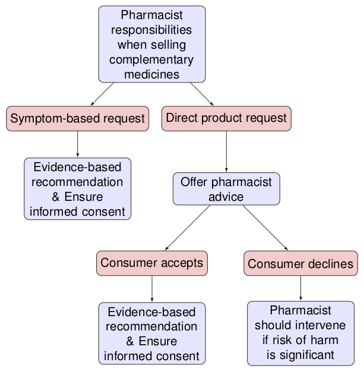
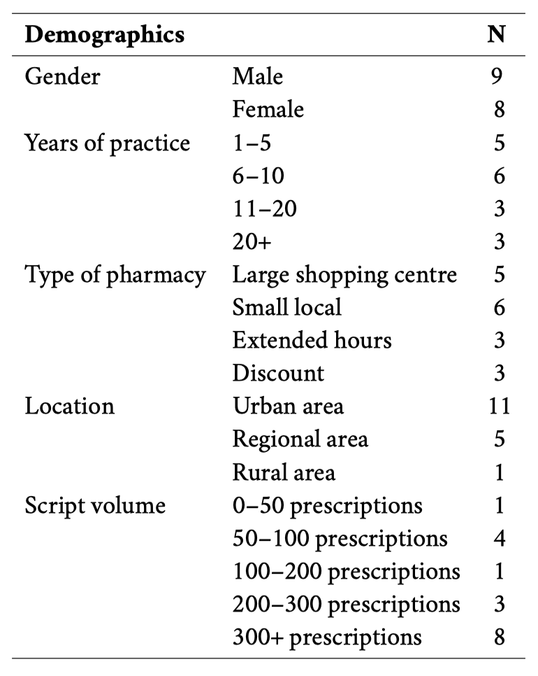
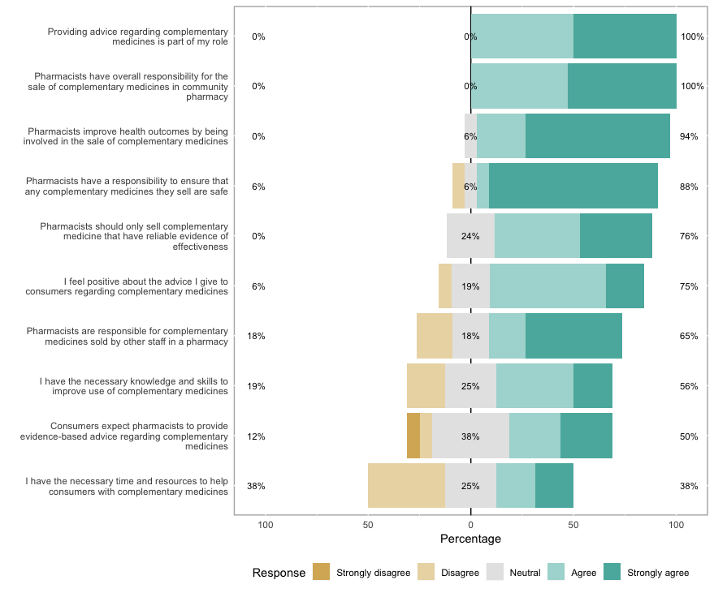
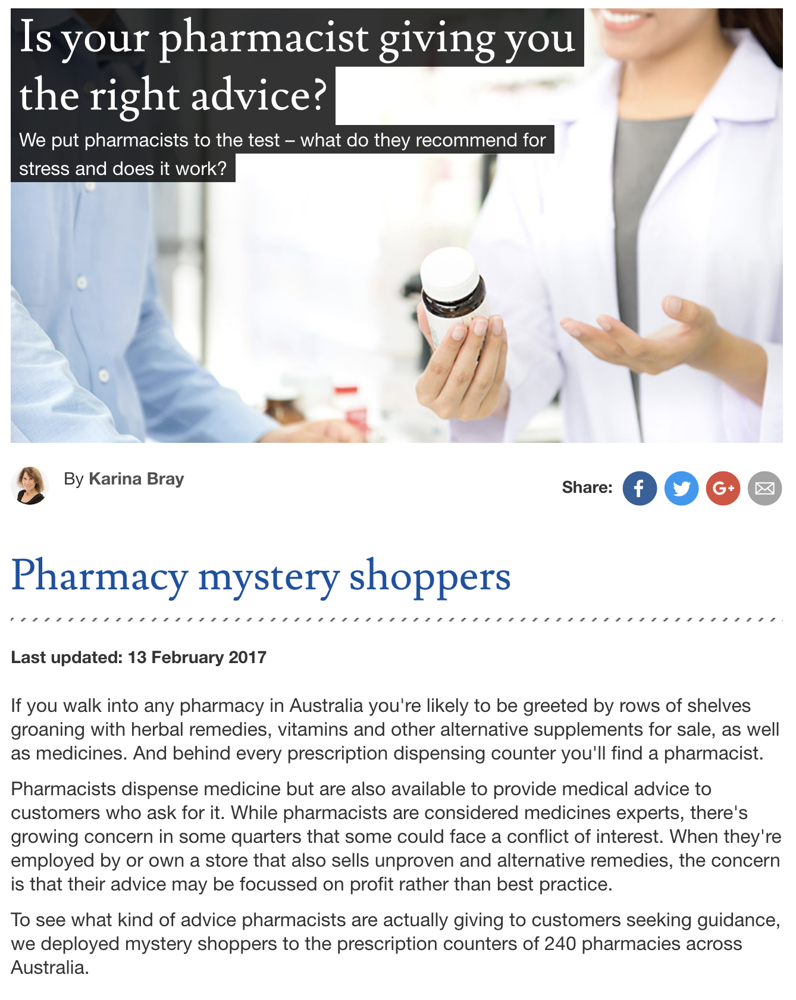

## Ethics and complementary medicines

* There is surprisingly little detailed ethical debate regarding the sale of complementary medicines in pharmacy [@SalmanPopattia2018;@Ung2017]

* There is a tendency in the literature to raise ethical conflicts  without seeking to resolve these conflicts (e.g. between business interests and evidence-based practice)

* While principle-based ethics is often implied, a theoretical basis for ethical decision-making is rarely articulated

## A framework for pharmacist responsibilities when selling complementary medicines {data-background=#FBB800}

1. Principle-based ethics provides the theoretical foundation for the framework [@Beauchamp2012]

2. *Public health argument* for pharmacists selling complementary medicines

3. The responsibilities pharmacists need to fulfil when selling and recommending complementary medicines in order to meet their obligations to the public

## Responsibilities {data-background=#FBB800}

1.  Pharmacists should provide evidence-based recommendations to consumers regarding complementary medicines

2.  Pharmacists should train all staff in a pharmacy and ensure that they provide evidence-based recommendations regarding complementary medicines and seek advice of a pharmacist when required

3.  When providing advice, pharmacists should provide sufficient information for consumers to make informed decisions regarding complementary medicines

## {data-background=#FBB800}

4.  Pharmacists should setup the pharmacy so that consumers are provided an offer of advice from a pharmacist and pharmacists are available to provide that advice

5.   Pharmacists must be vigilant for complementary medicine harm and intervene if risk of harm is significant

<!-- ## {data-background=#EB602B}

{width="50%"}

Flowchart for pharmacist responsibilities when selling complementary medicines

 -->

## Aim {data-background=#4085C6}

Evaluate the acceptability and feasibility of the proposed ethical framework for the sale of complementary medicines in community pharmacies

<!-- * How do pharmacists vary in their approach to the sale of complementary medicines?
* Identify any barriers to the acceptance or implementation of the framework in community pharmacy -->

## Methods {data-background=#4085C6}

* Australian community pharmacists were invited to participate in online focus groups in September and October 2019

* Pharmacists were recruited using social media, professional organisations, and communication through the professional networks of key community pharmacy banner groups (e.g. Terry White Chemmart, Good Price Pharmacy Warehouse, Chemist Warehouse, Amcal, Guardian, ...)

## {data-background=#4085C6}

* Focus group methods were modified for the online environment (Zoom videoconference) [@Basch1987; @Knodel1993; @Gaiser2017]

* Semi-structured one-on-one interviews were conducted when focus groups were not possible

* Participants received the ethical framework prior to the workshop and were asked to complete a short pre-workshop survey

* Focus group and interviews were video and audio recorded and transcribed verbatim then inductively coded and themes identified and refined using thematic analysis [@Braun2016]

## Results & Discussion 

* Seventeen community pharmacists participated in 4 focus groups and 6 individual interviews

* The workshops contained 2--4 participants and went from 29 to 68 minutes in duration (median 42.5 minutes)

* The duration of the interviews ranged from 17 to 34 minutes (median 21 minutes)

## Demographics

{width="50%"}

<!-- ## Pre-survey

 -->

<!-- NOTE: 29/11/2019 this needs work -->

## Theme 1: Approach to complementary medicines (reactive--proactive)

...you feel a lot **more secure at the back counter** or in a dispensary than you do out in the vitamin section. (D5P8)

 

\

Pharmacists are becoming more involved than before. People are trusting pharmacists more. They always check their complementary medicine. (D1P1)

 

## Theme 2: Approach to evidence

 [W]e shouldn't just be selling things because someone ... says, "Oh, this turmeric is great for the sake of curing cancer." I think __there has to be some level of evidence...__  (D4P5)
 

\

 ...[this] is where __placebo effects__ comes in. So hey, if it's not doing them any harm and they think it's better for them and they're going on in their life and happy days, you just let them go. (D5P7)

## Variation within themes

{width="65%"}

## Theme 3: Navigating practice in a retail environment

I own a pharmacy ... I still work in the shop on a daily basis. So I still come across on a daily basis having to chat to people about this. But them I am also going to come at it from the side [that __complementary medicines__] __prop up half of the bank loan__. (D5P7)
 

\

If a pharmacy's going to lose money for the sake of a sale, that isn't a good enough reason for the sake of giving something out. We should always be having a look at evidence-based treatments, ... (D4P5)
 

<!-- ## Acceptability & feasibility of the framework {data-background=#FBB800}

* Most participants felt the framework was **acceptable**

* Some had concerns regarding **feasibility**---these depended how they approached complementary medicines and approached evidence

* Main perceived threat to acceptability was __cost impost__---directly rebutted by other participants -->

## Acceptability & feasibility 

{width="65%"}

<!-- ## Enabling implementation {data-background=#FBB800}

* __Independent training__ for pharmacy support staff in evidence-based practice & the framework---basics for for all staff with pathways to more advanced training for champions

* Provide guidance on __information resources__ -->

## Conclusion & next steps {data-background=#51247A}

* The *Framework for pharmacist responsibilities when selling complementary medicines* provides specific guidance to pharmacists on fulfilling their responsibilities when selling complementary medicines

* The framework is __acceptable__ to pharmacists and most felt it was __feasible__---especially with targeted support 

* The framework and findings of this study will be submitted to key professional professional bodies with the aim of informing policy

## Thanks & questions {data-background=#51247A}

*Acknowledgements*

* This work was supported by an APSA Research Grant
* Without this support it would not have been completed (yet)
* Thank you to the professional services pharmacist that distributed the project invitation to their colleagues

*Questions*

* [Themes & common topics](#/themes-common-topics-back){style="color:#FBB800"}
* [Quotes regarding cost impost](#/acceptability-cost-impost){style="color:#FBB800"}
* [Additional threats to acceptability](#/additional-threats-to-acceptability){style="color:#FBB800"}
* [PSA Code of Ethics guidance](#/psa-code-of-ethics){style="color:#FBB800"}
* [References](#/references){style="color:#FBB800"}

<!-- ## Test Grid {data-background="files/CMEthics_context3.png"}

* 1 This work was supported by a APSA Research Grant
* Without this support it would not have been completed (yet)
* Thank you to the professional services pharmacist that distributed the project invitation to their colleagues

* 2 This work was supported by a APSA Research Grant
* Without this support it would not have been completed (yet)
* Thank you to the professional services pharmacist that distributed the project invitation to their colleagues

* 3 This work was supported by a APSA Research Grant
* Without this support it would not have been completed (yet)
* Thank you to the professional services pharmacist that distributed the project invitation to their colleagues

* 4 This work was supported by a APSA Research Grant
* Without this support it would not have been completed (yet)
* Thank you to the professional services pharmacist that distributed the project invitation to their colleagues

 -->

## Themes & common topics ([Back](#/thanks-questions))

{width="65%"}

## Acceptability & cost impost {style="font-size: 80%"}

I would say consumers mostly view [complementary medicines] as an __item of commerce__. You buy them like you buy bread and milk, in some instances, for some of them. So you’ve now imposed this cost on us providing evidence, but in order to do that, we have to mark the product up more. Then you’ve got this __two-tiered system__. (D5P7)

\

<!-- 
 Yeah, but I guess my point is more, why is the ownership on us as pharmacists and providing wages to pharmacists to go out and provide this advice, where you can go and explore and get it without advice? And then in order to recover those costs you mark the product up higher which means you can't then compete on an item of commerce. There's only so much people will pay for advice. (D5P7)
 -->

I think that having the degree means that ... people come for a __higher level of service__ and understanding than what they can get in the supermarket. And that's part of what differentiates us professionally. And that's part of why it's still called __a pharmacy and not a supermarket__. I'm comfortable that I would actually be probably more comfortable practising where the TGA just says, "Yes, that is safe to take." And then the pharmacist makes the clinical judgement and says, "Well, this may not be the best product for you." I think that that's literally our goal. (D5P9)
 

[Back](#/thanks-questions)

## Additional threats to acceptability

1. Need to have a clear account of evidence-based practice in this context

2. Need to address arguments that the framework **doesn't go far enough**: imprimatur of selling complementary medicines; implicit recommendations (shelf-talkers, etc)

[Back](#/thanks-questions)

## PSA Code of Ethics

Integrity
Principle 1 (h)

A pharmacist will only purchase, supply or promote any medicine, complementary medicine, herbal remedy or other healthcare product where there is credible evidence of efficacy and that benefit of use outweighs the risk

[Back](#/thanks-questions)

## References {style="font-size: 55%;"}

<!--
NOTE: initial early slides.. cut due to time

## Introduction

* Complementary medicines are a $4.9 billion dollar industry in Australia---41% of which is sold through pharmacies [@ComplementaryMedicinesAustralia2018]

* Consumers often expect complementary medicines sold in pharmacy to be more effective and safe [@Tran:2013kh]

* Many consumers purchase complementary medicines as a personal health choice and expect the health professional to act in a consultative role [@Kwan2008; @Iyer2016b]

##

{width="40%"}
{width="40%"}

Recent reports
from [CHOICE](https://www.choice.com.au/health-and-body/health-practitioners/doctors/articles/pharmacy-advice-for-stress)
and [Four
Corners](http://www.abc.net.au/4corners/stories/2017/02/13/4616948.htm)
highlight some of the problems relating to the sale of complementary
medicines in Australian community pharmacies [@Thompson2017; @Bray2017].
CHOICE sent secret-shoppers into community pharmacies and found that
pharmacists and pharmacy support staff recommended complementary
medicines that lacked evidence for effectiveness and frequently provided
misleading information regarding the likely effectiveness of the
product. This follows similar investigations, such as @Arnold2016 and
public discussion regarding the practice of community pharmacies selling
homeopathy [@Committee:2014tp].

There are two important components to these reports: (i) pharmacists are
selling products that lack evidence of efficacy and (ii) pharmacists are
provided misleading advice regarding efficacy.

## Code of Ethics (Australia)

Integrity
Principle 1 (h)

A pharmacist will only purchase, supply or promote any medicine, complementary medicine, herbal remedy or other healthcare product where there is credible evidence of efficacy and that benefit of use outweighs the risk
 

 -->

