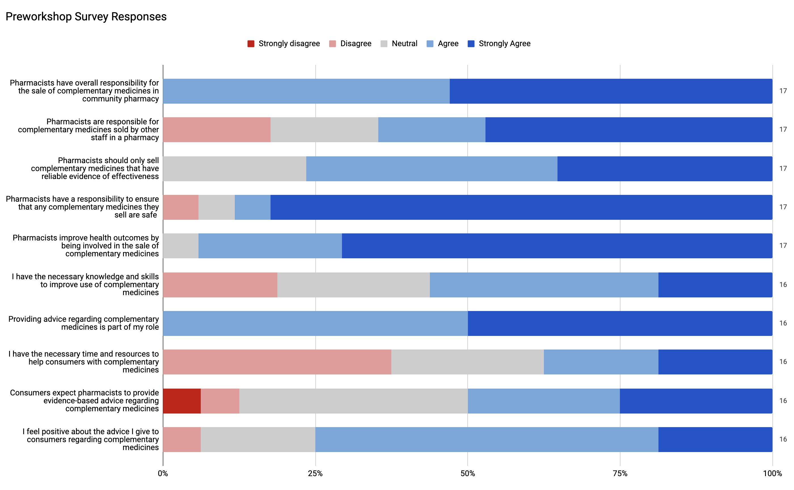
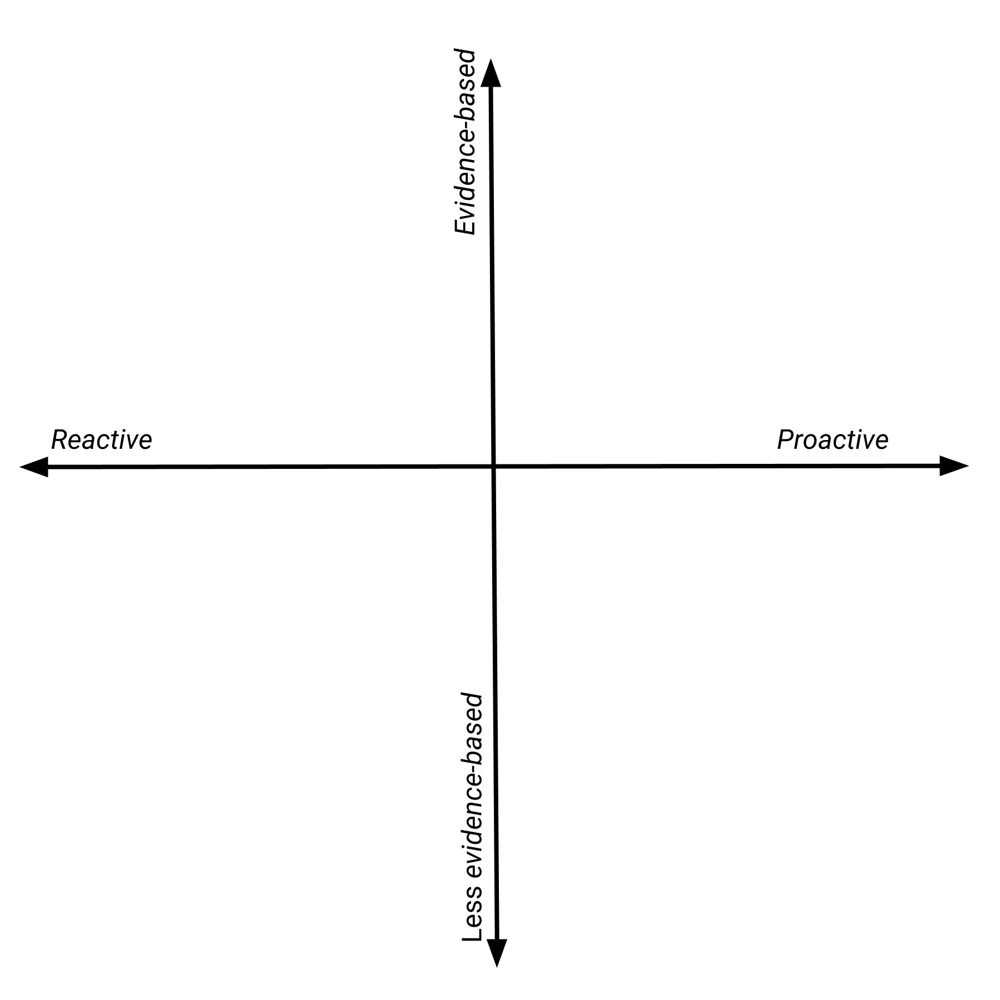
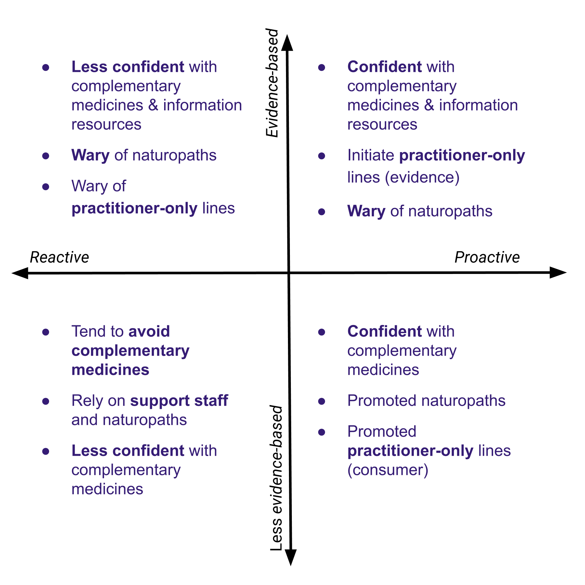
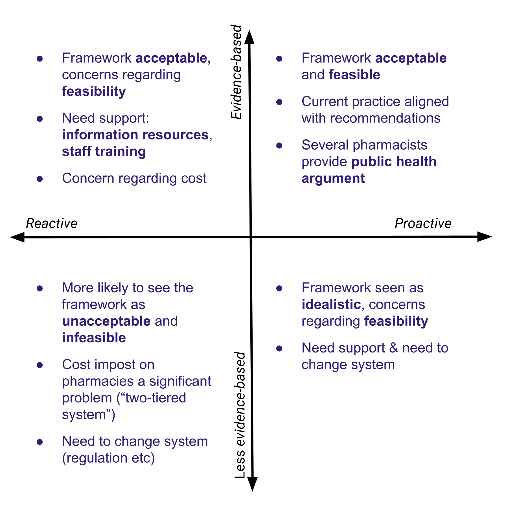

```{r include=FALSE, eval=TRUE}

options(tinytex.clean = FALSE)
library(knitr)
library(kableExtra)


```

```{r echo=FALSE, eval=!knitr::is_latex_output(), message=FALSE, warning=FALSE, tidy=TRUE, results='asis', error=FALSE}


cat("-------------------------------- ---------------------------------------
  Adam La Caze                     Lecturer
                                   School of Pharmacy
                                   The University of Queensland
                                   a.lacaze@uq.edu.au
  Amber Salman Popattia            PhD Candidate
                                   School of Pharmacy
                                   The University of Queensland
                                   amber.salmanpopattia@uqconnect.edu.au
  Laetitia Hattingh                Adjunct Associate Professor
                                   School of Pharmacy and Pharmacology
                                   Griffith University
                                   L.Hattingh@griffith.edu.au
  -------------------------------- ---------------------------------------")

```

\input{titlepage}


This is a report for the project *Evaluating the acceptability and feasibility of an ethical framework for the sale of complementary medicines in community pharmacy* funded by an Australasian Pharmaceutical Society of Australia (APSA) Research Grant 2019 and the School of Pharmacy, The University of Queensland.

\bigskip

\bigskip

\begin{tabular}{ll} Adam La Caze & Senior Lecturer\tabularnewline
& School of Pharmacy\tabularnewline
& The University of Queensland\tabularnewline
& a.lacaze@uq.edu.au\tabularnewline[10pt] Amber Salman Popattia & School of Pharmacy\tabularnewline
& The University of Queensland\tabularnewline
& amber.salmanpopattia@uqconnect.edu.au\tabularnewline[10pt] Laetitia Hattingh & Adjunct Associate Professor\tabularnewline
& School of Pharmacy and Pharmacology\tabularnewline
& Griffith University\tabularnewline
& L.Hattingh@griffith.edu.au\tabularnewline
\end{tabular}

\bigskip

Correspondence: 

Adam La Caze  
[a.lacaze@uq.edu.au](mailto:a.lacaze@uq.edu.au)  

School of Pharmacy  
The University of Queensland  
St Lucia  4072  


<!-- TODO: 25/02/2020 add acknowledgements -->


<!-- \vfill -->

<!-- \hfill __Version__: [`r system("git rev-parse --short HEAD", intern = TRUE)`](https://github.com/alacaze/cmethics_apsa)  -->
<!-- \hfill `r format(Sys.time(), '%d %B, %Y')` -->

\newpage


# Executive Summary {-}

There is a need for clearer guidance for pharmacists regarding their responsibilities when selling complementary medicines.
This project introduces an ethical framework for the sale of complementary medicines in community pharmacy, and then evaluates the acceptability and feasibility of implementing the framework in practice.

The ethical framework was developed using principle-based ethics and consists of (i) a public health argument for having pharmacists involved in the sale of complementary medicines and (ii) the specific responsibilities that pharmacists need to meet to make a positive contribution to health outcomes by selling complementary medicines.

Seventeen community pharmacists participated in four focus groups and six individual interviews.
There was good representation among participants in terms of gender, years of practice, pharmacy location and script volume.
<!-- TODO: Insert key results and changes -->
The majority of participants found the framework was acceptable for practice and was feasible for implementation with some targeted support.
Participants tended to differ in how proactive they were in relation to selling and providing advice on complementary medicines, how they interpreted evidence in relation to complementary medicines, and how they navigated their practice within the retail environment of community pharmacy.

Some participants expressed concern that the framework put additional responsibilities and associated costs on pharmacists when selling complementary medicines in comparison to alternative outlets.
However, the majority of participants felt that the additional responsibilities were appropriate and that pharmacies compete in terms of the services they provide rather than merely cost.
Participants identified two important areas for targeted support in implementing the framework: additional guidance and improved access to evidence-based information resources on complementary medicines and independent evidence-based education and training on complementary medicine for pharmacists and pharmacy support staff.

The *Framework for pharmacist responsibilities when selling complementary medicines* addresses an important gap in providing specific professional guidance to pharmacists when selling complementary medicines.
The results of the study suggest that the framework will be acceptable to most pharmacists and is feasible to implement with targeted support. 


\newpage 

\tableofcontents

\newpage


<!-- * Approach complementary medicines: some participants were proactively involved in selling complementary medicines and providing advice, other participants were more reactive in their approach, frequently relying on support staff to provide advice on complementary medicines.
* Approach evidence: most participants expressed a commitment to evidence-based practice, but some participants expressed views inconsistent with evidence-based practice in relation to complementary medicines. These participants tended to emphasise the importance of placebo effects and relied heavily on anecdotal evidence.
* Navigate practice in a retail environment: all participants recognised that they worked in a retail environment and sought to ensure they met they professional obligations within this environment. Participants tended to differ -->


\newpage

# Introduction


<!-- TODO: this para needs work 11/12/2019 -->
<!-- This project seeks to contribute to pharmacy practice by developing guidance to pharmacists regarding their responsibilities when selling complementary medicines. -->
Complementary medicines are a $4.9 billion dollar industry in Australia, 41% of which is sold through pharmacies [@ComplementaryMedicinesAustralia2018].
Consumers purchase complementary medicines from pharmacies due to a trust in the quality of the products and the availability of advice [@Traulsen2004; @Tran2013; @Iyer2016a].
There is
clear recognition that pharmacists should (i) support consumer choice
and (ii) provide advice that is informed by evidence [@InternationalPharmaceuticalFederation2014; @PSA2017].
There is,
however, very little guidance on what to do when these two principles
conflict.
The conflict arises because many complementary medicines lack
rigorous evidence of effectiveness and yet can cause harm through
adverse effects, drug interactions and delayed treatment [@Myers2004; @Izzo2009].
<!-- In the absence of evidence of benefit, evidence-based guidance suggests that pharmacists should avoid selling complementary medicines [@Ernst1996]. -->
<!-- But removing complementary medicines from community pharmacy removes the opportunity for pharmacists to support consumers in the safe use of complementary medicines. -->
Recent reports suggest that pharmacists are failing to meet community expectations regarding the advice they provide on complementary medicines [@Bray2017; @Thompson2017; @Arnold2016; @King2017]

<!-- A contributing factor to this is that the responsibilities of pharmacists when selling complementary medicines are not well articulated. -->

@SalmanPopattia2018 identify several gaps in the literature regarding the responsibilities of pharmacists selling complementary medicines. 
The most striking of these is the lack of specific guidance for pharmacists on the sale of complementary medicines.
The expectations of pharmacists
and consumers regarding the sale of complementary medicines are well
described [@Iyer2016a; @Tran:2013kh; @Kanjanarach2011].
To the extent
that ethical considerations are discussed in this literature, the
conflict between supporting consumer choice, evidence-based practice and
business considerations are frequently identified but never resolved.
Part of the problem is the lack of an explicit ethical theory to guide
decision-making. 
While the ‘four principles approach’ of bioethical
principlism is implicit in many discussions, the version that is
employed focuses on ‘ethics first-aid’: the *identification* of ethical
conflicts rather than resolution of the conflict [@Beauchamp2012; @Pullman2005]

The problems associated with the lack of specific guidance for
pharmacist responsibilities when selling complementary medicines is
highlighted by the current *Code of ethics for pharmacists* [@PSA2017].
While the code provides the advice to support consumer choice and to
practice in accordance with evidence, it also provides the directive
that pharmacists will “only purchase, supply or promote any medicine,
complementary medicine, herbal remedy or other healthcare product where
there is credible evidence of efficacy and the benefit of use outweighs
the risk”. 
This directive is in contrast with current practice in which
complementary medicines that lack credible evidence of efficacy are
frequently purchased and supplied. 
There is no attempt to reconcile this
disparity in the professional or academic literature—no explicit
argument for the directive provided in the code, nor a counter-argument
defending the routine sale of complementary medicines that lack evidence
of efficacy in community pharmacy.

Salman Popattia and La Caze have developed an ethical framework that provides specific guidance to pharmacists regarding their responsibilities when selling complementary medicines.
The framework seeks to identify the responsibilities that pharmacists would need to meet in order to ensure the sale of complementary medicines in community pharmacy support good consumer health outcomes.
An overview of the framework is provided below.

# A framework for pharmacist responsibilities when selling complementary medicines

There are three components to the framework: principle-based ethics provides the theoretical foundations, a *public health argument* provides *prima facie* support for the sale of complementary medicines in community pharmacy, and specific responsibilities are provided that ensure that pharmacists meet their obligations to the public when selling complementary medicines.

## Principle-based ethics

Principle-based ethics, and more specifically, the 'four principles approach' to bioethics advocated by @Beauchamp2012, is frequently employed in bioethics and professional ethics in health care.
The four principles are *respect for autonomy*, *beneficience*, *non-maleficence*, and *justice*.
The four principles approach, including the account of *specification* adopted within the approach, provides a framework for responding to ethical challenges by explicitly seeking to resolve conflicts in general principles based on salient details within the context [@Richardson2000].

The specific responsibilities provided by the framework were developed by considering key ethical principles in pharmacy practice such as the need for pharmacists to provide evidence-based care as well as to respect the health beliefs and preferences of consumers.
These practice principles themselves can be derived from more general guiding principles, such as ensuring positive health outcomes in consumers (beneficence and non-maleficence) and respecting autonomy.
The framework seeks to resolve the conflicts that arise in these principles in relation to pharmacists selling complementary medicines.


## Public health argument

The second component of the framework is a public health argument for pharmacists selling complementary medicines.
This argument is driven by two key points.
First, complementary medicines are regulated in Australia (and most regions in the world) as being sufficiently safe for self-care.
Most complementary medicines available in community pharmacy are *listed* on the Australian Register of Therapeutic Goods [@TGA2019_listed].
This means that the complementary medicine contains items that are on a list of low-risk ingredients, is manufactured according to the principles of Good Manufacturing Practice, and the only claims made regarding therapeutic use relate to the maintenance and enhancement of health for non-serious, self-limiting conditions [@TGA2019_listed].
Listed medicines are available from a wide range of outlets, including pharmacies, health food stores, and supermarkets.
Many consumers choose to use complementary medicines and are likely to continue to do so even if they were not available in community pharmacies.

Second, pharmacists are highly accessible health professionals with the training and skills to provide guidance on the appropriate use of complementary medicines.
<!-- While pharmacists often express a lack of confidence in relation to complementary medicines,  -->
In particular, pharmacists have skills in being able to identify and resolve potential drug interactions and to provide guidance regarding actual or potential adverse reactions.
Pharmacists tend to focus on this role in relation to complementary medicines and consumers frequently identify this support as one of the drivers for purchasing complementary medicines from community pharmacies [@Olatunde2010;@Kanjanarach2011].

These points provide a *prima facie* argument in support of the sale of complementary medicines in community pharmacy.
However, some pharmacists are hesitant to discuss complementary medicines with consumers, and some provide inaccurate or misleading information regarding the likely benefits of complementary medicines [@SalmanPopattia2018;@Arnold2016;@Bray2017].
<!-- A limitation of this argument, however, is that pharmacists are not always proactive in providing advice regarding the safe use of complementary medicines, and sometimes provide inaccurate or misleading information regarding the likely benefits of complementary medicines [@SalmanPopattia2018;@Arnold2016;@Bray2017]. -->
The specific responsibilities of pharmacists when selling complementary medicines outlined below seek to address these issues.
The framework identifies the responsibilities that pharmacists must
meet in order to make a positive contribution to health outcomes by
selling complementary medicines. 


## Specific responsibilities

The key responsibilities outlined by the framework are provided below.
The responsibilities overlap in some respects, but each articulates a specific responsibility for pharmacists working in a community pharmacy and managing staff in relation to complementary medicines.
The framework makes a distinction between pharmacy staff making an *explicit recommendation* to take a complementary medicine, and  selling complementary medicines without an explicit recommendation.
The framework suggests that *recommendations* for a complementary medicine must be consistent with current best evidence, and all *sales* of a complementary medicine should be accompanied with an *offer* of advice from a pharmacist.
A pharmacist must be available to provide that advice and to provide sufficient information to the consumer such that they can make an informed decision with regard to the purchase of the complementary medicine.
Since some consumers might refuse the offer of advice from a pharmacy, it is the responsibility of the pharmacist to have  procedures in place to identify and intervene if a consumer is at significant risk of harm from complementary medicines.
<!-- Further advice regarding the responsibilities outlined in the framework are available in Appendix A. -->

<!-- TODO: 25/02/2020 Appendix A -->

***Key responsibilities of pharmacists selling complementary medicines***

1. Pharmacists should provide evidence-based recommendations to the consumers regarding complementary medicines
2. Pharmacists should train all staff in a pharmacy and ensure that they provide evidence-based recommendations regarding complementary medicines and seek advice of a pharmacist when required
3. When providing advice, pharmacists should provide sufficient information for consumers to make informed decisions regarding complementary medicines
4. Pharmacists should setup the pharmacy so that consumers are provided an offer of advice from a pharmacist and pharmacists should be available to provide that advice
5. Pharmacists must be vigilant for possible harms related to complementary medicines and intervene if risk of harm is significant

<!-- ```{r framew, echo=FALSE, eval=TRUE, message=FALSE, warning=FALSE, tidy=TRUE, results=TRUE, error=FALSE}
framew <- as.data.frame(read.csv2(file = "fig_tab/framework.csv", header = FALSE))

kable(framew, caption = 'The key responsibilities of pharmacists selling complementary medicines', booktabs = TRUE, col.names = "Responsibilities") %>% 
  column_spec(1,width = "30em")

``` -->

<!-- \input{fig_tab/tab_framework.tex} -->

<!-- 
1. Pharmacists should provide evidence-based recommendations to the consumers regarding complementary medicines
2. Pharmacists should train all staff in a pharmacy and ensure that they provide evidence-based recommendations regarding complementary medicines and seek advice of a pharmacist when required
3. When providing advice, pharmacists should provide sufficient information for consumers to make informed decisions regarding complementary medicines
4. Pharmacists should setup the pharmacy so that consumers are provided an offer of advice from a pharmacist and pharmacists should be available to provide that advice
5. Pharmacists must be vigilant for complementary medicine harm and intervene if risk of harm is significant -->

# Aim

<!-- In order for the framework to make a contribution to pharmacy practice, the guidance it provides must be accepted and implemented by community pharmacists.
This requires consultation with community pharmacists in order to identify the acceptability and feasibility of the guidance and to identify any areas of support that may be required to implement the framework. -->

The __specific aim__ of this project was to evaluate the acceptability and feasibility of the proposed ethical framework for
the sale of complementary medicines in community pharmacy.
The project also sought to identify any barriers to the acceptance and/or implementation of the framework in community pharmacy.


# Methods

Australian community pharmacists were invited to participate in online workshops via a videoconferencing platform in September and October 2019. 
Pharmacists were recruited using social media, professional organisations, and communication through the professional networks of key community pharmacy banner groups.
Purposive sampling was employed to ensure that the age and gender distribution of participants
reflects the workforce and that participants are recruited with
different levels of experience and from different practice environments
(small independent pharmacies, large chains, and discount-oriented
pharmacies). 

<!-- Recruitment will continue until there is saturation of key themes. 
It is
expected that 5–6 focus groups will be convened, with each group
comprising 5–8 participants.

Informed consent will be sought from all participants in the project.

Participation in the workshop meets the requirements of continuing
professional development. 
Accreditation of the workshop as a continuing
professional development activity will be sought from the Pharmaceutical
Society of Australia. 
If approved, this will be advertised to
prospective participants.
 -->


The workshops employed focus group methods to engage participants in discussion regarding the sale of complementary medicines in community pharmacies.
Focus groups provide an opportunity to investigate complex behaviours and motivations, to learn more about the degree of consensus on a topic, and to gain feedback regarding new ideas [@Basch1987; @Knodel1993].
They are especially helpful to understand group norms, meanings and processes [@BarbourFG2011].
Workshops were offered inside and outside of usual business
hours using video-conferencing software, Zoom. 
<!-- Experience with conducting focus groups via online environments suggests there are both benefits and challenges [@Gaiser2017; .@Irani2019] -->
Conducting focus groups via video-conference provided an opportunity to recruit participants from a large geographical area.
<!-- Challenges include ensuring engagement from participants and adequate interaction within the group. -->
A number of strategies were employed to support the success of conducting the focus group in an online environment, these included seeking to arrange groups of 4--6 participants (limiting larger groups), enabling video feeds and offering alternatives for those with lower internet speeds [@Gaiser2017].

Participants received information about the framework prior to the workshop and were asked to complete a short pre-workshop survey.
The objectives of the workshops were 
(i) to examine the range of views community pharmacists have regarding their responsibilities when selling complementary medicines; 
(ii) to assess perceived appropriateness and feasibility of the developed ethical framework; 
(iii) to identify organisational, professional and personal barriers to the acceptance and/or implementation of the ethical framework, and 
(iv) to aid the development of specific guidance for pharmacists in applying the ethical framework.
Discussion topics explored the context in which pharmacists provide advice on complementary medicines within community pharmacy, and the acceptability and feasibility of the proposed ethical framework.
<!-- TODO: consider adding the discussion outline -->
The semi-structured interviews conducted with participants unable to join a workshop followed the same structure.
<!-- The Theoretical Domains Framework was used to frame pre-workshop survey questions, discussion prompts within the workshop and the analysis of the participant responses.
The Theoretical Domains Framework was developed to provide a
theoretically-informed approach to identifying factors that influence
whether health professionals implement evidence-based guidance [@Atkins2017a].-->

All focus groups and interviews were conducted by AL.
It was made clear from the start of each focus group and interview that the objective of the discussion was to understand the participants' views and how they varied.
Participants were encouraged to share diverging views and to debate topics in a respectful manner.
The facilitator did not share views during the focus groups or interviews.
ASP was an observer for most of the focus groups and interviews.
AL and ASP debriefed immediately following each focus group and interview and prepared a summary that was sent to participants for comment.

The workshops and interviews were video and audio recorded. 
<!-- Participants received a summary of the workshop or interview discussion and were provided an opportunity to comment on and clarify any aspect of the summary. -->
Focus groups and interviews were transcribed verbatim.
The transcripts were analysed using the
thematic analysis methods described by Braun and Clarke [-@Braun2016].
An inductive approach to coding was employed, and themes were developed with a focus on addressing the research questions in the study.
Two investigators, AL and ASP, familiarized themselves with the data and developed an initial coding scheme.
This was refined through discussion  early in the analysis and then used to code the focus groups and interviews. 
AL and ASP then identified and refine themes individually first, and then as a group that included LH.

All three investigators have experience in pharmacy ethics. 
AL has experience in qualitative research, facilitation of online groups and research and teaching in ethical reasoning and decision-making in pharmacy practice.
ASP has a background in nursing and bioethics and developed the ethical framework as part of her PhD.
LH has experience in health law and ethics and qualitative research.
LH was involved in development of the Pharmaceutical Society of Australia *Code of ethics for pharmacists*.

# Results

Forty-one community pharmacists expressed an interest in participating and thirty pharmacists indicated their availability for a workshop or interview.
Seventeen community pharmacists participated in 4 workshops and 6 individual interviews.
The 13 participants who had indicated their availability for a workshop or interview but did not participate were contacted to reschedule, but none took up this option.
The workshops contained 2--4 participants and went from 29 to 68 minutes in duration (median duration 42.5 minutes).
The duration of the interviews ranged from 17 to 34 minutes (median 21 minutes).
Demographic features of the participants are provided in Table 2.
<!-- There was good variability in key demographic variables among the participants. -->
Participants varied in terms of gender, years of practice and type of pharmacy and typical script volume.
More than a third of participants worked in a regional or rural location.
<!-- TODO: LH Could you give a breakdown of numbers – how many attended the four workshops. I assume 11 in total and ideally say how many in each Ideally also mention how many pharmacists were contacted in total. I know this may be tricky as various approaches were followed but could you indicate how many were emailed etc. after they showed initial interest? -->

\input{fig_tab/tab_demo.tex}

The presurvey questions provide a snapshot of the participants' views about complementary medicines in terms of their day-to-day practices.
Most participants agreed with statements regarding providing advice to consumers about complementary medicines as being part of their role, and feeling positive about the advice they give to consumers regarding complementary medicines.
Participants were less likely to agree with statements regarding their possession of the necessary knowledge and skills in relation to complementary medicines, and a statement regarding possessing the necessary time and resources to help consumers with complementary medicines.

<!--  -->

<!-- ```{r echo=FALSE, eval=TRUE, message=FALSE, warning=FALSE, tidy=TRUE, results=TRUE, error=FALSE, fig.caption='Results of the presurvey. Statements are ordered by the percentage of agreement of the participants.', out.width='12cm'}


``` -->


## Key themes 

The focus groups and interviews provided rich information on how pharmacists approached their practice in relation to complementary medicines, their perceptions of the proposed framework and their views regarding the facilitators and barriers to implementing the framework in practice. 
A number of themes were consistently discussed in the focus groups and interviews.
Reviewing transcripts following the analysis, thematic saturation occurred after 3 focus groups and 4 interviews (13 participants), additional focus groups and interviews helped to explore and confirm key findings.
Three main themes emerged from the focus groups and interviews.
These themes are summarised in Table 3.
The first two themes represent spectra on which participants differed: *Approach to complementary medicines (proactive--reactive)* and *Approach to evidence*.
The third theme, *Navigating practice in a retail environment*, represents the recognition from all participants that community pharmacy is in a retail environment and decisions regarding professional practice have resource and other financial implications.

\input{fig_tab/tab_themes.tex}


The ways in which participants *approached complementary medicines*, *approached evidence*, and *navigated practice in a retail environment* inform how they viewed their responsibilities in relation to complementary medicines within the context of community pharmacy practice.
How participants approached these key themes also informed their views on the acceptability and feasibility of the proposed framework.
Each of these themes are briefly introduced below.
Subsequent sections provide further discussion regarding how participant responses within these themes addresses the objectives of the project.
Understanding these themes, and the ways in which participants varied within the themes provide insight into the *context* (Section \ref{context}) of community pharmacy practice in relation to complementary medicines, and the *acceptability* and *feasibility* of the framework as perceived by the participants (Section \ref{acceptability} and \ref{feasibility}).
<!-- TODO: see LH think about a figure for the themes -->

### Approach to complementary medicines

A number of participants described their practice in terms of a proactive approach to complementary medicines.
These participants tended to initiate discussion regarding complementary medicines with consumers and see an important role for pharmacists in being proactive in relation to complementary medicines.

> Pharmacists are becoming more involved than before. People are trusting pharmacists more. They always check their complementary medicine. I think, from what I remember five years ago, people were just picking it up. They were thinking that, "That's just a supplement," but I think the awareness is more than before among people. So they always come and ask, "Oh, is this one safe?" or, "What should I take?" I think now, lots of pharmacists are always checking things for them. (D1P1)[^1]

Some participants worked in community pharmacies with a specific set-up facilitating provision of specialist advice on  complementary medicines, including the use of practitioner-lines.

> I work in a small community pharmacy. I probably consider myself a integrated pharmacist. We have complementary medicines in three different areas similar to the rest of your medicines, like S2s, S3s. So we've got some out in the front shop, which I consider your [day-to-day] vitamins, like your supermarket lines. They're more lines that are more for patients to choose and that sort of thing if they want to self-select. If they go for advice from a pharmacist or staff member, we'd probably go for something a bit better quality. So we've got some in the S2 section which are, I guess, better quality practitioner ranges. And then we've got your other ones in your S3 areas which are ranges that do require a consult or a prescription. So a lot of them are prescribed by some of our doctors as well. (D7P13)

[^1]: Workshops and interviews are labelled as "Discussions" and numbered in order. "Participants" are also allocated a number in order. "D1P1" refers to Discussion 1, Participant 1.

By contrast, other participants adopted a reactive approach to complementary medicines.
These participants indicated that they are less likely to initiate discussion of complementary medicines with consumers, and were more likely to express a lack of confidence in complementary medicines.
Participants expressing these views tended to rely more heavily on support staff in this area.
<!-- TODO: LH add quote for last sentence -->

> I suppose it's not as big a focus in my professional practice.... I think it's probably because of lack of knowledge, to be honest, and confidence, where you feel a lot more secure at the back counter or in a dispensary than you do out in the vitamin section. (D5P8)

For some participants, a reactive role towards complementary medicines was seen as a consequence of the lack of evidence for the effectiveness of many of these medicines.

> Yeah. I think at the moment, I don't think we have much role to play in selling or providing any counselling for complementary medicine because first, working in community pharmacy, our main role is actually just dispensing. And then pharmacies, I think, we should follow more like evidence-based medicine practise.... All this supplementary of complementary medicine and all, they're not evidence-based. (D5P6)


### Approach to evidence

Participants also varied in their approach to evidence.
Most participants explicitly endorsed "evidence-based practice" in relation to complementary medicines, but what participants took this to mean and how it related to their day-to-day practice tended to differ.

Many participants described their practice in a way that is consistent with evidence-based practice while also recognising some of the challenges.

> [W]e shouldn't just be selling things because someone ... says, "Oh, this turmeric is great for the sake of curing cancer." I think there has to be some level of evidence... And it's hard in certain conditions because you're just never going to have the trials. (D4P5)

A number of participants felt there should be a greater emphasis on evidence-based practice in relation to complementary medicines.

> If we, I think, perhaps as an industry, move towards more-- well, what is the evidence? Do I feel that your needs will be met by what I'm recommending today? Is there evidence to support what it says on the label, or what it says in the marketing material? And if not, then maybe we, as an industry, could push the emphasis of companies bringing things to market, being more about actual evidence. More money going into these studies of N equals 50. (D5P9)

Some participants, however, expressed views inconsistent with evidence-based practice. 
These participants put significantly more weight into anecdotal reports and placebo effects as providing evidence for the effectiveness of complementary medicines.
In response to the explicit PSA guidance to only sell complementary medicines that are efficacious, one participant felt that placebo effects were sufficient to meet this standard.

> So how I would actually interpret [the PSA guidance], and this is where placebo effects comes in. So hey, if it's not doing them any harm and they think it's better for them and they're going on in their life and happy days, you just let them go. (D5P7)

Other participants put a lot of value into anecdotal experience.

> So I see a lot of people really---a lot of people want to use it. I've talked to a lot of customers, and they do feel the result. Every time they come back, I always ask, "Is this working for you?" And a lot of times, they say, "Yes, I know it's working because when my bottle ran out, I started feeling it." So then they came back to get a new bottle. So regarding your first question where you say, "What's our perspective regarding purchase of natural medications?" I think they really work. I think they work depending what the situation is. There are some situations where you obviously need something more potent. But even in those situations, I think there's always a place for natural medication, either as a stand-alone treatment or in combination. This is just based on what I've seen, not just what I think, what I've seen from what people say. (D9P16)

Participants tended to vary according to their approach to complementary medicines and approach to evidence independently.
<!-- (as well as their perceptions of their colleagues approach to complementary medicines and approach to evidence). -->
Different participants expressed each of the following views: "proactive and evidence-based", "reactive and evidence-based", "proactive and less evidence-based" and "reactive and less evidence-based" (see Figure\ \ref{context3}).
Here, for example, is one of the participants suggesting that most pharmacists they knew were "reactive and evidence-based"

> I would think in the most part people are very reactive. I don't know that people would proactively engage in conversations a lot in my experience. But I think if they were asked, then they would provide evidence-based information to the best of their knowledge. (D6P10)

Where participants exist on these spectra informed their response to a variety of topics regarding the sale of complementary medicines in community pharmacy, including the role of naturopaths, the availability and confidence the participant had with regard to information resources, practitioner-only products and the proposed framework.




### Navigating practice in a retail environment

All participants discussed implications of the retail environment within the context of fulfilling their professional obligations.
Participants who were pharmacy owners, in particular, recognised the impact of complementary medicines on the financial bottom-line of the pharmacy.

> I own a pharmacy ... I still work in the shop on a daily basis. So I still come across on a daily basis having to chat to people about this. But then I am also going to come at it from the side [that complementary medicines] prop up half of the bank loan. So I guess we are going to go both ways on this a little bit. (D5P7)

Participants differed, however, in how they navigated practice in the retail environment.
Most participants sought to prioritize professional obligations over financial considerations.

> If a pharmacy's going to lose money for the sake of a sale, that isn't a good enough reason for the sake of giving something out. We should always be having a look at evidence-based treatments, ...
>  (D4P5)

These participants focused on ensuring appropriate practice within the confines of financial constraints.
Because participants differed in how they viewed appropriate practice in the context of complementary medicines, they also differed on the financial impost they were willing to accept to fulfil the responsibilities outlined in the proposed framework.
This topic is discussed in detail below in relation to the acceptability and feasibility of the framework.

## Context 

Participants described how they approached complementary medicines in day-to-day interactions with consumers as well as how they thought pharmacists *should* approach such interactions.
They also discussed what resources they had available to them to assist consumers with complementary medicines as well as any barriers they experienced when providing advice to consumers in relation to complementary medicines.
Topics frequently raised by participants in focus groups and interviews were the role of naturopaths in community pharmacy, the availability of resources on complementary medicines and the increasing role of practitioner-only complementary medicine lines.
Practitioner-only lines have typically been sold by naturopaths working in the pharmacy, but in recent years pharmacists have become more actively involved in these sales.
Most of these complementary medicines are regulated in the same way as complementary medicines sold in the front shop, but are marketed such that only certain practitioners should sell the item (typically naturopaths and pharmacists).
How participants approached these topics was informed by the approach they took to complementary medicines and their views regarding evidence.
These views are summarised in Figure\ \ref{fig_context2}.



In brief, participants who were "proactive" and "evidence-based" tended to have access to and be confident users of information resources on complementary medicines and actively recommend practitioner-only lines when they viewed such a recommendation as supported by evidence. 
These participants tended to see an important role for evidence-based naturopaths, but most expressed concern regarding naturopaths who they had worked with who in their view did not provide evidence-based advice.
Participants who described their practice as evidence-based, but took a more passive (reactive) approach to complementary medicines were also wary about naturopaths, but were less likely to recommend  pracititioner-only lines and less likely to express confidence in relation to information resources on complementary medicines.
Participants who were "proactive" and "less evidence-based" tended to express confidence in relation to their knowledge and practice in relation to complementary medicines as well as the knowledge and practice of naturopaths. 
These participants actively recommended practitioner-only lines.
Participants who were "less evidence-based" and "reactive" in relation to complementary medicines tended to rely on support staff and naturopaths to provide advice to consumer and expressed a lack of confidence in relation to their knowledge and skills in relation to complementary medicines.

<!-- ### Naturopaths in community pharmacy

Participants expressed a range of attitudes in relation to the role of naturopaths in community pharmacy.
Participants with a greater focus on evidence-based practice tended see the benefits in having a naturopath in-store that shared that focus.
However, only some of these participants found that the naturopaths they worked with had an evidence-based focus.

> My take on it is, surely pharmacists and naturopaths should, essentially, have the same information, the same evidence. We should come to the same conclusions. Now there's going to be better and perhaps not so great professionals in both industries. There's going to be differing opinions, but that's just healthy science. Surely we should cooperate. There's definitely room for both, and there's definitely room for businesses that see the value of a great naturopath.... (D5P9)
> 
> ...[I]s that the experience you've had, that naturopaths are coming from the same perspective? (AL)
> 
> Personally, the one that I had, absolutely not.... 
> The guy, if he didn't know he would just make it up. And I do not run that sort of pharmacy, so that immediately rubbed me the wrong way. (D5P9)

A common source of contention for participants with a focus on evidence-based practice, was the tendency of naturopaths to recommend homeopathy.

> In terms of naturopaths, I have no faith in homoeopathic products from everything that I've learned at university, which was quite a long time ago. Yeah. I don't trust homoeopathic products. So I would never recommend a homoeopathic product, and I would question the use of a homoeopathic product. So in terms of that and naturopaths in pharmacy, I would be quite uncomfortable with that. (D9P15)

Participants who talked about practice in ways that were less evidence-based, such as those who relied on placebo effects or put considerable weight on anecdotal reports, tended to be more supportive of the role of naturopaths in community pharmacy.
These participants were inclined to view the knowledge of naturopaths as complementary to the knowledge pharmacists, with both professionals sharing a similar overall perspective with differing areas of expertise.
Some of these participants also noted the benefits that having a good naturopath in the pharmacy can have on sales.

> The naturopaths have done the studies of all the herbs and everything else where the pharmacists just get a basic top knowledge. So I think that the naturopaths know a lot more because they've been taught and they've had to do research. Whether we're getting the same, I don't think pharmacists have the in-depth knowledge to go deeply into all the herbs and everything else, all the complementary medicines. So some would, but at this point in time, I don't see any training out there for pharmacists to help their knowledge in depth. So I would say the naturopath has a lot more than the pharmacists. But working together - we have the drug knowledge; they have the complementary knowledge - helping people to live a better life combined would be awesome. (D8P14)

> ...

> We used to have a naturopath but they're really hard to get and keep. I know that one of our other stores has a naturopath and we will, quite often, ring and ask them for advice. I think that they have a lot more knowledge in this area. And if you can get one into store, it can boost your sales considerably and boost the confidence that people have in that area because they do have that knowledge. And then backing them up if they have questions with medications and things like that, the pharmacist can back them up. But I think that if you can get a naturopath you can develop your complementary medicine area really quite nicely. (D8P14)

### Information resources on complementary medicines

Participants views on the information resources available in community pharmacy differed according to their approach to complementary medicines and approach to evidence.
Participants with a proactive approach to complementary medicines and who had an evidence-based focus in their practice frequently had a range of information resources available to them (some of them paid for by the pharmacy), which they were confident in using and they found helpful.

> Also, I think a really important resource I use is on the Natural Standard database. So especially when looking at interactions like if someone's on blood pressure medication, you can easily see whether or not they should be-- yeah. If there's interactions and it also gives you level of evidence as well, like mild, moderate, that sort of thing. (D7P13)

Other resources included access to information provided by particular manufacturers, especially manufacturers of practitioner-only lines.

> I guess, we all use Dr. Google. Probably not for the best. I guess, some companies are better. I know BioCeuticals, we have one of their massive books which, if we need to look something up, gives us a really good guideline. Some of the companies-- I think Nature's Own has a hotline. Blackmores may have a hotline that you can actually ring and ask and speak to somebody. But it's all time-consuming. And in this day and age, a lot of people don't want that time-consuming job. (D8P14)

Participants who took a more reactive approach to complementary medicines were more likely to express a desire for more access to better resources.

> I feel like it would be really helpful if there was a better database to look up interactions and all that type of thing because more often than not, I have to call either the company or look into it really far to make sure it doesn't interact. (D3P4)

### Practitioner-only lines

Practitioner-only lines have typically been sold by naturopaths working in the pharmacy, but in recent years pharmacists have become more actively involved in these sales.
Most of these complementary medicines are regulated in the same way as complementary medicines sold in the front shop, but are marketed such that only certain practitioners can sell the item (typically naturopaths and pharmacists).
Several participants described a high level of activity in personally selling and recommending practitioner-only lines.
See, for example, the second quote in Section\ \ref{approach-to-complementary-medicines}.
Most of these participants had an evidence-based focus in their practice and were proactive in relation to complementary medicines.
These participants saw practitioner-only lines as a way to support and provide evidence-based complementary medicines, with many of the companies selling these product providing resources to support their sale.

> I think we also sort of need to look at the practitioner-only ones and those companies out there that are doing good research and seeing what sort of role they play as well because I think, at the moment, they are a good thing that is available, but a lot of consumers don't know about it, and they might buy a cheaper fish oil from the supermarket. Obviously, they could still buy the cheaper product, but I mean, I think there's something to look into there as well. (D2P3) -->

## Acceptability of the framework {#acceptability}

Most participants felt the framework was acceptable: that it accurately captured the responsibilities of pharmacists when selling complementary medicines.
Participants were more likely to express concern regarding the feasibility of the framework.
Participant views on the acceptability and feasibility of the framework tended to be informed by how they approached complementary medicines and how they approached evidence.
The other key determinant was how the participant navigated practice within a retail environment.
<!-- The main perceived threat to the acceptability of the framework was the cost impost to pharmacists of implementing the framework when other retailers of complementary medicines are not obligated to provide the same services.
This view was most strongly expressed by participants who were reactive in relation to complementary medicines and described a  less evidence-based approach to practice.
This view was directly challenged by other participants in the focus group who felt that it was important for pharmacies to compete on services *and* cost rather than cost alone. -->
Participant views regarding the acceptability and feasibility of the framework are summarised in Figure\ \ref{accfeas}.



<!-- ### Acceptability -->

<!-- The majority of participants felt the framework was acceptable, especially those who were "proactive" *or* "evidence-based". -->
Participants who were "proactive" _and_ "evidence-based" were most strongly in favour of the proposed ethical framework.
These participants saw the framework as a being closely aligned with their practice and commended the clear guidance the framework provided regarding pharmacist responsibilities when selling complementary medicines.

> I think generally pharmacists are time poor and stressed and overburdened, so anything that can make something more simplified and streamlined with clear-cut expectations is useful. (D7P12)

> ...

> I would say [the framework is acceptable], particularly with, yeah, treating it along the lines of an S2 or an S3. So front-shop staff can talk to the patients about it. If there's any further queries, the pharmacist can be involved, but they don't automatically have to come down and talk to them if it's not something that there's any questions about. (D7P11)

Several participants provided an argument along the lines of the public health benefit to support the sale of complementary medicines in community pharmacies.

> I think the reason that pharmacies should sell their complementary medicine is not because there is a market. I think people, instead of going to the health food store to get their complementary medicine, they should come to the pharmacy because there is a better chance that the pharmacies can find out if there's any interaction for people with some actual medications. But I know most of my customers. I know exactly what they are taking. If they come and someone on warfarin asks me for some complementary medication, I just quickly before going and checking their medical history, I know that that's not the right thing to give to the person. But if that person goes to the health food store and buy it there, there is no way that they can figure it out. So I think they should be always at the pharmacy because people should think to go to pharmacy to get their complementary medicine because that way they are going to be protected and lots of trauma is going to be stopped. (D1P1)

Two threats to acceptability were identified by participants.
The primary perceived threat to the acceptability of the framework was that it permits a "two-tiered system"  for the sale of complementary medicines.
The framework identifies responsibilities for pharmacies selling complementary medicines that are not expected of other retailers.
This point was raised in several focus groups and interviews.
The following quotes illustrate the back-and-forth between a participant who argues the framework is not acceptable due to the differential cost it imposes on community pharmacies and a second participant who argues that part of being a pharmacist involves such obligations.

> I would say consumers mostly view [complementary medicines] as an item of commerce. You buy them like you buy bread and milk, in some instances, for some of them. So you’ve now imposed this cost on us providing evidence, but in order to do that, we have to mark the product up more. Then you’ve got this two-tiered system. (D5P7)


> I think that having the degree means that ... people come for a higher level of service and understanding than what they can get in the supermarket. And that's part of what differentiates us professionally. And that's part of why it's still called a pharmacy and not a supermarket. I'm comfortable that I would actually be probably more comfortable practising where the TGA [Therapeutic Goods Administration] just says, "Yes, that is safe to take." And then the pharmacist makes the clinical judgement and says, "Well, this may not be the best product for you." I think that that's literally our goal. (D5P9)

The second threat to the acceptability of the framework is a consequence of the different approaches participants take to evidence-based practice.
The proposed framework assumes a shared understanding of what is considered appropriate evidence for the efficacy of complementary medicines.
Participants who expressed an approach to evidence in complementary medicines that was less evidence-based appear to hold a different view.
Accepting placebo effects as sufficient evidence of the efficacy of complementary medicines and/or putting considerable weight into the anecdotal experiences of others are approaches to evidence that are incompatible with the framework.
Similarly, for those who take the view that placebo effects and anecdotal reports are sufficient evidence for determining the efficacy of complementary medicine, the proposed framework will be viewed as unacceptable.


The importance of taking this into account is illustrated in the response some participants had to the guidance on complementary medicine provided in the current *Code of ethics for pharmacists*.
For example, some participants suggested that they were practising in accordance with the guidance provided in the code of ethics on the basis of the purported placebo effects of complementary medicines (see, for example, the third quote in Section\ \ref{approach-to-evidence}).
Determining appropriate evidence for assessing the effectiveness of complementary medicines is complex and somewhat controversial.
Some of the considerations include the availability of well-conducted randomized trials and the lack of impetus for such trials given they are not a regulatory requirement.
While it is not necessary (or feasible) to resolve all of these issues for the purposes of the proposed framework, it is necessary to identify some boundaries in relation to approaches to evidence and complementary medicines.
The findings of this study suggest two such boundaries are the use of placebo effects and anecdotal reports (in other consumers) as a justification for recommending complementary medicines.


## Feasibility of the framework {#feasibility}

Participants tended to be more concerned about the feasibility of the framework as opposed to its acceptability.
The specific barriers that participants identified, and the kinds of things that would enable participants to overcome the barrier, depended on how participants approached complementary medicines and evidence.

Participants who were "evidence-based" and  "proactive" tended to see the framework as both acceptable and feasible as presented.
Participants who were "evidence based" and "reactive" expressed concerns about the feasibility of implementing the framework.
These participants tended to identify local, practical barriers and to identify areas of support that would remedy these concerns.
The two most consistently identified barriers were the availability of (and confidence with) evidence-based information resources on complementary medicines and staff training.
Some example quotes highlighting the importance of information resources and training and some of the optimism participants expressed to addressing these barriers:

> Oh. I think it's a very nice framework in an ideal world, and if we are provided with tools and training and the resources to train the staff, I would be very happy to have that in the pharmacy. (D2P2)

> I feel like it would be really helpful if there was a better database to look up interactions and all that type of thing because more often than not, I have to call either the company or look into it really far to make sure it doesn't interact. So maybe extra training in that area like compulsory training, I guess. (D3P4)

> So I think, honestly, I would just be keen to try it out in the shop and see how it actually works. But it's sort of one of those questions. If you change the framework and require pharmacies to do something, some sort of fundamental change in how we provide advice, would that open up the space for a new database to actually provide some money so someone would actually make it? Would that then mean that companies looking to get their products into pharmacy would put more emphasis on evidence and therefore training? So pharmacists wouldn't have to be doing these trainings. You're going to get detailed by companies that are looking to get the best, most evidence-based product into your stores. (D5P9)

The absence of independent evidence-based training for pharmacy support staff was identified as a barrier to implementing the framework.
The response to this is providing more opportunities for this kind of training. 

> I've got 30 staff, and the idea that there could be more specialised training for people that have that interest [in evidence-based complementary medicines] and that could be another avenue for non-pharmacists into pharmacy careers. Immediately, that's more attractive than going to work at Woolies, where they just sell the stuff en mass for profit. How would that not be a good thing when we've copped a lot of bad press about some pharmacists? So yeah, definitely. I would be very interested to see if this framework allowed for more of that. (D5P9)

A number of participants identified an increased focus on practitioner-only lines as one way to differentiate pharmacy services in relation to complementary medicines while fulfilling the professional obligations outlined in the framework.

> Well, I feel like there should be, I guess, a shift away from the front-shop selling. So just to distinguish pharmacy from the health food store, so other things that people just see on TV or things that people can buy without talking to a pharmacist or talking to someone that's been trained in complementary medicines. So there's the idea of what we've got, the pharmacy, with labelling it, even though it's not necessarily a dangerous product, but just something that at least requires a consult from the first go. Not every time but just from the initial, first-selling to them so they know exactly why they're taking it, rather than just they've been taking it for 10 years. And if we said, "Well, this is a better product, a better form of calcium or whatever it might be," at least that way they can think of their complementary medicines along the same lines as their regular medications. So they still put some value on it, and they don't just look for the cheapest option or the most convenient, necessarily, but something that they get more value out of. (D7P11)

Participants who described their practice in a way that was less evidence based tended to agree with the barriers and facilitators identified above as well as express additional concerns regarding the feasibility of implementing the framework.
Participants who were "proactive" and "less evidence-based" tended to see the framework as acceptable though idealistic, and suggest that it could only be implemented if there were significant system  changes made to support the framework.
Participants who were "reactive" and "less evidence-based" were more likely to view the framework as both unacceptable and infeasible.
These participants had significant concerns about cost implications.
The system changes that each of these groups of participants suggested were similar.
<!-- While some of these suggestions were also endorsed or suggested by participants who described an evidence-based approach to practice, they were more commonly suggested by participants who described a less evidence-based approach to practice. -->
Suggestions included ensuring all pharmacies implemented the framework in a similar way (perhaps taking a regulatory approach to assessing compliance with the framework) and making changes to the way the complementary medicines were regulated such that there were tighter restrictions on the availability of complementary medicines. 
<!-- (thereby avoiding creating a two-tiered market due to the costs associated with pharmacists meeting the responsibilities of the framework). -->

> ...[G]etting all the pharmacies on the same page. If you've got pharmacies that are run by corporations and banner groups that are more for-profit versus small community pharmacies that are trying to provide a service. You've got to have these frameworks that are enforceable, maybe through QCPP [Quality Care Pharmacy Program] or a PBS [Pharmaceutical Benefits Scheme] listing, and make sure that everyone does the same things and stocks the same products and doesn't stock the same products based on evidence. (D7P12)

> The next thing, I think, would be TGA [Therapeutic Goods Administration]. If they're approving it, but then it's not evidence based, then consumers will get confused because they would say, "Oh, but then it's approved by TGA, so it must be all right or evidence based." (D10P17)

> Why should it be up to us as pharmacists? Why shouldn't the TGA---when it goes to them in the first place to be approved, why is it even getting to us? Why are we required to make the decision? Why haven't TGA done their job? (D5P7)


<!--  NOTE: some things I haven't discussed

* Traffic light system
*  -->

# Discussion & recommendations

<!-- The framework adopts an approach to medical evidence that recognises both the importance of well designed trials in providing evidence that taking a complementary medicine produces the expected benefits and a sound scientific understanding of the mechanisms by which the complementary medicine may benefit or cause harm [@Parkkinen2018a]. -->


The *Framework for pharmacist responsibilities when selling complementary medicines* provides specific guidance to pharmacists on fulfilling their responsibilities when selling complementary medicines.
The framework seeks to address current gaps in the professional and academic literature with regard to the availability of specific professional guidance supported by an explicit theoretical approach.
It addresses apparent conflicts in pharmacist responsibilities for promoting positive health outcomes and respecting consumer health beliefs with recognition of the consumer practices in relation to complementary medicines, the regulation of these products and the roles that pharmacists play in providing advice on these products.
The community pharmacists participating in the study tended to differ in how proactive they were in relation to complementary medicines, the degree to which they adopted an evidence-based approach to their practice, and how they navigated practice in a retail environment.
These factors informed the way in which participants approached complementary medicines in their day-to-day practice and how they approached the proposed framework.
The study findings suggest that the proposed framework will be acceptable to most pharmacists and is feasible to implement with some targeted support.


<!-- The focus groups provided a way to explore group norms in relation to professional responsibilities when selling complementary medicines as well as to discuss and explore proposed ethical framework. -->

The strengths of the study include asking participants to respond to specific advice on the responsibilities of pharmacists when selling complementary medicines, the variation present in the demographic details of the participants, and the features of the qualitative methods that permit an in-depth examination of how the participants approached complementary medicines and the framework.
<!-- Some of the limitations of the study arise due to the methods used. -->
Further quantitative work with a larger representative sample of pharmacists would be required to estimate the prevalence of different approaches to complementary medicines in Australian community pharmacy (e.g. "evidence-based", "proactive", etc).
While the study did not include the perspectives of consumers or pharmacy support staff, the perspectives of these groups have been explored elsewhere [@Iyer2016a].

<!-- The study identifies a number of barriers and enablers to the acceptability and feasibility of the framework to the community pharmacists who participated in the study. -->
The acceptability of the framework to most participants is an important precondition on the successful implementation.
Participants who are evidence-based and proactive towards complementary medicines are likely to act as champions for the framework.
Equally important are the barriers identified by participants who felt the framework is acceptable but had concerns regarding feasibility.
Appropriately addressing these barriers will help to shift pharmacists towards an evidence-based and proactive approach to complementary medicines.
Specific activities that would support this shift include the development of support regarding evidence-based information resources, and evidence-based training on complementary medicines aimed at both pharmacists and pharmacy support staff.

Several participants indicated that better access to and confidence with evidence-based information resources on complementary medicines would help.
Suitable information resources are available and used within community pharmacy (as indicated by other participants).
This suggests that guidance on the availability, strengths and limitations of key evidence-based information resources available to community pharmacists could aid pharmacists unfamiliar with these resources.
A second and related activity is the availability of training for pharmacists and pharmacy support staff.
There is a lot of sponsor-provided training opportunities in community pharmacy for both pharmacists and pharmacy support staff.
Participants in this study identified the need for independent evidence-based learning opportunities in complementary medicines for both pharmacists and pharmacy support staff.
Similar needs have been identified in the literature [@Tiralongo2010;@Iyer2016a].
Learning activities specifically targeting evidence-based health care and the role of pharmacists and pharmacy support staff in providing appropriate advice regarding complementary medicines would facilitate implementation of the framework.
These learning activities could then feed into longer-term projects such as the development of a career pathway for pharmacy support staff with expertise in providing evidence-based advice regarding complementary medicines.

The initiatives outlined above are targeted at pharmacists who identify an evidence-based approach to complementary medicines but experience barriers to taking a more proactive approach to complementary medicines.
This is likely the most effective and efficient strategy and can be implemented at the same time larger-scale regulatory actions regarding complementary medicines are considered.
The framework in addition to training activities and further guidance on evidence-based information resources on complementary medicines has the benefit of providing clear guidance on the responsibilities of pharmacists when selling complementary medicines, and building the capacity of pharmacists and pharmacy support staff to deliver evidence-based advice and support to consumers using complementary medicines.

<!-- NOTE: say something about the code of ethics and what the study says about the responsibilities that pharmacists actually take. -->

# Conclusion

The *Framework for pharmacist responsibilities when selling complementary medicines* addresses an important gap in providing specific professional guidance to pharmacists when selling complementary medicines.
The results of the study demonstrate that the framework will be acceptable to most pharmacists and is feasible to implement with targeted support. 

# Acknowledgements {-}

This project was conducted thanks to the funding provided by the Australasian Pharmaceutical Science Association (APSA) Research Grant 2019 and the School of Pharmacy, The University of Queensland.

The investigators would like to thank the community pharmacists who gave their time to share their expertise for the project.
Thanks also to Chris Campbell, Carolyn Clementson, and Marlene Nguyen who distributed invitations to participate in the project through their professional networks.

# References


