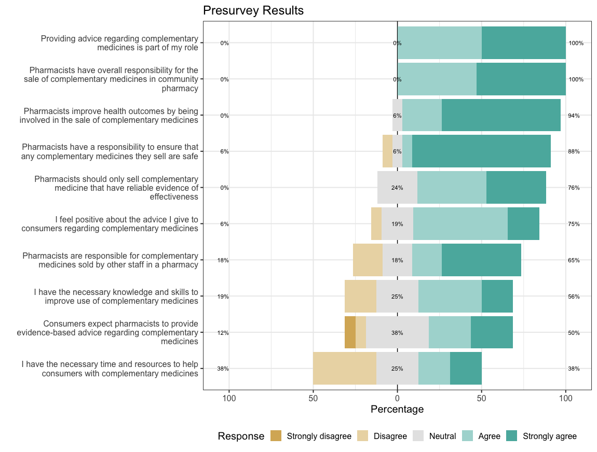

```{r include=FALSE}

options(tinytex.clean = FALSE)

```

<!--   -------------------------------- ---------------------------------------
  Adam La Caze                     Lecturer
                                   School of Pharmacy
                                   The University of Queensland
                                   a.lacaze@uq.edu.au
  Amber Salman Popattia            PhD Candidate
                                   School of Pharmacy
                                   The University of Queensland
                                   amber.salmanpopattia@uqconnect.edu.au
  Laetitia Hattingh                Adjunct Associate Professor
                                   School of Pharmacy and Pharmacology
                                   Griffith University
                                   L.Hattingh@griffith.edu.au
  -------------------------------- --------------------------------------- -->

\begin{tabular}{ll} Adam La Caze & Lecturer\tabularnewline
& School of Pharmacy\tabularnewline
& The University of Queensland\tabularnewline
& a.lacaze@uq.edu.au\tabularnewline[10pt] Amber Salman Popattia & School of Pharmacy\tabularnewline
& The University of Queensland\tabularnewline
& amber.salmanpopattia@uqconnect.edu.au\tabularnewline[10pt] Laetitia Hattingh & Adjunct Associate Professor\tabularnewline
& School of Pharmacy and Pharmacology\tabularnewline
& Griffith University\tabularnewline
& L.Hattingh@griffith.edu.au\tabularnewline
\end{tabular}

\vfill
This is a draft report for the project *Evaluating the acceptability and feasibility of an ethical framework for the sale of complementary medicines in community pharmacy* funded by an APSA Research Grant 2019.

\bigskip
\textbf{Document}: \vers
\newpage 

\tableofcontents

\newpage

# Synopsis

Many consumers choose to use complementary medicines and frequently purchase their complementary medicines from community pharmacy.
Pharmacists tend to vary in their approach to the sale of complementary medicines and recent media reports suggest that some pharmacies are failing to meet community expectations regarding the advice they provide.
There is a need for clearer guidance for pharmacists regarding their responsibilities when selling complementary medicines.
The investigators have developed an ethical framework for the sale of complementary medicines in community pharmacy.
This project evaluated the acceptability and feasibility of implementing an ethical framework for the sale of complementary medicines in community pharmacy developed by the investigators.
Seventeen community pharmacists participated in four focus groups and six individual interviews.
There was good representation among participants in terms of gender, years of practice, pharmacy location and script volume.
<!-- Insert key results and changes -->

# Background


<!-- TODO: this para needs work 11/12/2019 -->
Complementary medicines are a $4.9 billion dollar industry in Australia, 41% of which is sold through pharmacies [@ComplementaryMedicinesAustralia2018].
Consumers purchase complementary medicines from pharmacies due to a trust in the quality of the products and the availability of advice.[REF]
However, recent reports suggest that pharmacists are failing to meet community expectations regarding the advice they provide on complementary medicines [@Bray2017; @Thompson2017; @Arnold2016; .@King2017]
A contributing factor to this is that the responsibilities of pharmacists when selling complementary medicines are not well articulated.
There is
clear recognition that pharmacists should (i) support consumer choice
and (ii) provide advice that is informed by evidence [@InternationalPharmaceuticalFederation2014; @PSA2017].
There is,
however, very little guidance on what to do when these two principles
conflict.
<!-- ---which they frequently do in the context of complementary medicines. -->
The conflict arises because many complementary medicines lack
rigorous evidence of effectiveness and yet can cause harm through
adverse effects, drug interactions and delayed treatment [@Myers2004; @Izzo2009].
In the absence of evidence of benefit,
evidence-based guidance suggests that pharmacists should avoid selling
complementary medicines [@Ernst1996].
But removing complementary
medicines from community pharmacy removes the opportunity for
pharmacists to support consumers in the safe use of complementary
medicines. 
This project seeks to contribute to pharmacy practice by
developing clear and practical guidance to pharmacists regarding their
responsibilities when selling complementary medicines.

@SalmanPopattia2018 identify several gaps in the literature examining the responsibilities of pharmacists selling complementary medicines. 
The most striking of these is the lack of specific guidance for pharmacists on the sale of complementary medicines.
The expectations of pharmacists
and consumers regarding the sale of complementary medicines are well
described [@Iyer2016a; @Tran:2013kh; @Kanjanarach2011].
To the extent
that ethical considerations are discussed in this literature, the
conflict between supporting consumer choice, evidence-based practice and
business considerations are frequently identified but never resolved.
Part of the problem is the lack of an explicit ethical theory to guide
decision-making. 
The ‘four principles approach’ of bioethical
principlism is implicit in many discussions, but the version that is
employed focuses on ‘ethics first-aid’: the *identification* of ethical
conflicts rather than resolution of the conflict [@Beauchamp2012; @Pullman2005]

The problems associated with the lack of specific guidance for
pharmacist responsibilities when selling complementary medicines is
highlighted by the current *Code of ethics for pharmacists* [@PSA2017].
While the code provides the advice to support consumer choice and to
practice in accordance with evidence, it also provides the directive
that pharmacists will “only purchase, supply or promote any medicine,
complementary medicine, herbal remedy or other healthcare product where
there is credible evidence of efficacy and the benefit of use outweighs
the risk”. 
This directive is in contrast with current practice in which
complementary medicines that lack credible evidence of efficacy are
frequently purchased and supplied. 
There is no attempt to reconcile this
disparity in the professional or academic literature—no explicit
argument for the directive provided in the code, nor a counter-argument
defending the routine sale of complementary medicines that lack evidence
of efficacy in community pharmacy.

Salmon Popattia and La Caze have developed an ethical framework that provides specific guidance to pharmacists regarding their responsibilities when selling complementary medicines (currently under preparation for publication).
Details of the framework are provided in Appendix A, and an overview is provided below.

# A framework for pharmacist responsibilities when selling complementary medicines

There are three components of the framework: principle-based ethics provides the theoretical foundations, a *public health argument* provides *prima facie* support for the sale of complementary medicines in community pharmacy, and specific responsibilities are provided that ensure that pharmacists meet their obligations to the public when selling complementary medicines.

## Principle-based ethics

Principle-based ethics, and more specifically, the 'four principles approach' to bioethics advocated by @Beauchamp2012, is frequently employed in bioethics and professional ethics in health care.
The four principles are *respect for autonomy*, *beneficience*, *non-maleficence*, and *justice*.
The theory provides resources for further specifying these general principles when they conflict in particular contexts.
The approach---using *reflective equilibrium* and *specification*---provides a framework for responding to ethical challenges by explicitly weighing up and resolving conflicts in general principles based on salient details within the context [REF].

The specific responsibilities provided by the framework were developed by weighing up mid-level principles such as the need for pharmacists to provide evidence-based care as well as to respect the health beliefs and preferences of consumers.
These mid-level principles can be derived from more general guiding principles, such as ensuring positive health outcomes in consumers (beneficence and non-maleficence) and respecting autonomy.
The framework seeks to resolve the conflicts that arise in these principles in relation to pharmacists selling complementary medicines.


## Public health argument

The second component of the framework is a public health argument for pharmacists selling complementary medicines.
This argument is driven by two key points.
First, complementary medicines are regulated in Australia (and most regions in the world) as being sufficiently safe for self-care.
Most complementary medicines available in community pharmacy are *listed* on the Australian Register of Therapeutic Goods [@TGA2019_listed].
This means that the complementary medicine contains items that are on a list of low-risk ingredients, is manufactured according to the principles of Good Manufacturing Practice, and the only claims made regarding therapeutic use relate to the maintenance and enhancement of health for non-serious, self-limiting conditions.
Listed medicines are available from a wide range of outlets, including pharmacies, health food stores, and supermarkets.
Many consumers choose to use complementary medicines and are likely to continue to do so even if they were not available in community pharmacies.

Second, pharmacists are a highly accessible health professional with the training and skills to provide guidance on appropriate use of complementary medicines.
<!-- While pharmacists often express a lack of confidence in relation to complementary medicines,  -->
In particular, pharmacists have excellent skills in being able to identify and resolve possible drug interactions and to provide guidance regarding actual or potential adverse reactions.
Pharmacists tend to focus on this role in relation to complementary medicines and consumers frequently identify this support as one of the drivers for purchasing complementary medicines from community pharmacies [@Olatunde2010;@Kanjanarach2011].

The combination of these points provides a *prima facie* argument in support of the sale of complementary medicines in community pharmacy.
A limitation of this argument, however, is that pharmacists are not always proactive in providing advice regarding the safe use of complementary medicines, and sometimes provide inaccurate or misleading information regarding the likely benefits of complementary medicines [@SalmanPopattia2018;@Arnold2016;@Bray2017].
The specific responsibilities of pharmacists when selling complementary medicines outlined below seek to address these issues.
The framework identifies the responsibilities that pharmacists must
meet in order to make a positive contribution to health outcomes by
selling complementary medicines. 


## Specific responsibilities

The key responsibilities outlined by the framework are provided in Table\ \ref{responsibilities}.
The responsibilities overlap in some respects, but each articulates a specific responsibility for pharmacists working in a community pharmacy and managing staff.
The framework makes a distinction between pharmacy staff making an *explicit recommendation* to take a complementary medicine, and  selling complementary medicines without an explicit recommendation.
The framework suggests that *recommendations* for a complementary medicine must be consistent with current best evidence, and all *sales* of a complementary medicine should be accompanied with an *offer* of advice from a pharmacist.
If consumers take up that offer of advice, a pharmacist must be available to provide that advice and to provide sufficient information to the consumer such that they can make an informed decision with regard to the purchase of the complementary medicine.
Since some consumers might refuse the offer of advice from a pharmacy, it is the responsibility of the pharmacist to have  procedures in place to identify and act if a consumer is at significant risk of harm from complementary medicines.
Further advice regarding the responsibilities outlined in the framework are available in Appendix A.


\input{fig_tab/tab_framework.tex}

<!-- 
1. Pharmacists should provide evidence-based recommendations to the consumers regarding complementary medicines
2. Pharmacists should train all staff in a pharmacy and ensure that they provide evidence-based recommendations regarding complementary medicines and seek advice of a pharmacist when required
3. When providing advice, pharmacists should provide sufficient information for consumers to make informed decisions regarding complementary medicines
4. Pharmacists should setup the pharmacy so that consumers are provided an offer of advice from a pharmacist and pharmacists should be available to provide that advice
5. Pharmacists must be vigilant for complementary medicine harm and intervene if risk of harm is significant -->

# Aim

<!-- In order for the framework to make a contribution to pharmacy practice, the guidance it provides must be accepted and implemented by community pharmacists.
This requires consultation with community pharmacists in order to identify the acceptability and feasibility of the guidance and to identify any areas of support that may be required to implement the framework. -->

The __specific aim__ of this project is to evaluate the acceptability and feasibility of the proposed ethical framework for
the sale of complementary medicines in community pharmacy.
In addition to the question of whether the ethical framework was  acceptable to and feasible for community pharmacists, the project also sought to investigate how pharmacists vary in their approach to the sale of complementary medicine and to identify any barriers to the acceptance and/or implementation of the framework in community pharmacy.


# Methods

Australian community pharmacists were invited to participate in online workshops via a videoconferencing platform in September and October 2019. 
Pharmacists were be recruited using social media, professional organisations, and communication through the professional networks of key community pharmacy banner groups.
If necessary, purposive sampling was to be employed to ensure that the age and gender distribution of participants
reflects the workforce and that participants are recruited with
different levels of experience and from different practice environments
(small independent pharmacies, large chains, and discount-oriented
pharmacies). 

<!-- Recruitment will continue until there is saturation of key themes. 
It is
expected that 5–6 focus groups will be convened, with each group
comprising 5–8 participants.

Informed consent will be sought from all participants in the project.

Participation in the workshop meets the requirements of continuing
professional development. 
Accreditation of the workshop as a continuing
professional development activity will be sought from the Pharmaceutical
Society of Australia. 
If approved, this will be advertised to
prospective participants.
 -->


The workshops employed focus group methods to engage participants in discussion regarding the sale of complementary medicines in community pharmacies.
Focus groups provide an opportunity to investigate complex behaviours and motivations, to learn more about the degree of consensus on a topic, and to gain feedback regarding new ideas [@Basch1987; @Knodel1993].
They are especially helpful to understand group norms, meanings and processes [@BarbourFG2011].
Workshops were offered inside and outside of usual business
hours using video-conferencing software, Zoom. 
<!-- Experience with conducting focus groups via online environments suggests there are both benefits and challenges [@Gaiser2017; .@Irani2019] -->
Conducting focus groups via video-conference provided an opportunity to recruit participants from a large geographical area.
<!-- Challenges include ensuring engagement from participants and adequate interaction within the group. -->
A number of strategies were employed to support the success of conducting the focus group in an online environment, these included seeking to arrange groups of 4--6 participants (limiting larger groups), enabling video feeds and offering alternatives for those with lower internet speeds [@Gaiser2017].
<!-- NOTE: how? -->

Participants received information about the framework prior to the workshop and were asked to complete a short pre-workshop survey.
The objectives of the workshops were 
(i) to examine the range of views community pharmacists have regarding their responsibilities when selling complementary medicines; 
(ii) to assess perceived appropriateness and feasibility of the developed ethical framework; 
(iii) to identify organisational, professional and personal barriers to the acceptance and/or implementation of the ethical framework, and 
(iv) to aid the development of specific guidance for pharmacists in applying the ethical framework.
Discussion topics explored the context in which pharmacists provide advice on complementary medicines within community pharmacy, and the acceptability and feasibility of the proposed ethical framework.
The semi-structured interviews conducted with participants unable to join a workshop followed the same structure.
<!-- The Theoretical Domains Framework was used to frame pre-workshop survey questions, discussion prompts within the workshop and the analysis of the participant responses.
The Theoretical Domains Framework was developed to provide a
theoretically-informed approach to identifying factors that influence
whether health professionals implement evidence-based guidance [@Atkins2017a].-->

All focus groups and interviews were conducted by AL who has experience in qualitative research, facilitation of online groups and research and teaching in ethical reasoning and decision-making in pharmacy practice.
It was made clear from the start of each focus group and interview that the objective of the discussion was to understand the participants views and how they varied.
Participants were encouraged to share diverging views and to debate topics in a respectful manner.
The facilitator did not share views during the focus groups or interviews.
ASP was an observer for most of the focus groups and interviews.
AL and ASP debriefed immediately following each focus group and interview and prepared the summary that was sent to participants for comment.

The workshops and interviews were video and audio recorded. 
<!-- Participants received a summary of the workshop or interview discussion and were provided an opportunity to comment on and clarify any aspect of the summary. -->
Focus groups and interviews were transcribed verbatim.
The transcripts were analysed using the
thematic analysis methods described by Braun and Clarke [@Braun2016].
An inductive approach to coding was employed, and themes were developed with a focus on addressing the research questions in the study.
Two investigators, AL and ASP, familiarized themselves with the data and developed an initial coding scheme.
This was refined through discussion  early in the analysis and then used to code the focus groups and interviews. 
AL and ASP then identified and refine themes individually first, and then as a group that included LH.


# Results

<!-- Forty-one community pharmacists expressed an interest in participating and thirty pharmacists indicated their availability for a workshop or interview. -->
Seventeen community pharmacists participated in 4 workshops and 6 individual interviews.
The workshops contained 2--4 participants and went from 29 to 68 minutes in duration (median duration 42.5 minutes).
The duration of the interviews ranged from 17 to 34 minutes (median 21 minutes).
Demographic features of the participants are provided in Table 2.
<!-- There was good variability in key demographic variables among the participants. -->
Participants varied in terms of gender, years of practice and type of pharmacy and typical script volume.
More than a third of participants worked in a regional or rural location.

\input{fig_tab/tab_demo.tex}

The presurvey questions provide a snapshot of the participants views about complementary medicines in terms of their day-to-day practice.
Most participants agreed with statements regarding providing advice to consumers about complementary medicines as being part of their role, and feeling positive about the advice they give to consumers regarding complementary medicines.
Participants were less likely to agree with statements regarding their possession of the necessary knowledge and skills in relation to complementary medicines, and statement regarding possessing the necessary time and resources to help consumers with complementary medicines.



## Key themes 

The focus groups provided rich information on how pharmacists approached their practice in relation to complementary medicines, facilitators and barriers to this practice and their perceptions of the framework. 
Thematic saturation occurred after 3 focus groups and 4 interviews, additional focus groups and interviews helped to explore and confirm key findings.
Three main themes emerged from the focus groups and interviews.
These themes are summarised in Table 3.
The first two themes represent spectra on which participants differed: *Approach to complementary medicines (proactive--reactive)* and *Approach to evidence*.
The third theme, *Navigating practice in a retail environment*, represents the recognition from all participants that community pharmacy is in a retail environment and decisions regarding professional practice have resource and other financial implications.

\input{fig_tab/tab_themes.tex}

The ways in which participants *approached complementary medicines*, *approached evidence*, and *navigated practice in a retail environment* inform how they viewed their responsibilities in relation to complementary medicines within the context of community pharmacy practice and their views on the acceptability and feasibility of the proposed framework.
Each of these themes are briefly introduced in this section.
Further discussion is then provided regarding how participant responses within these themes addresses the objectives of the project.
Understanding these themes, and the ways in which participants varied within the themes provide insight into the *context* (Section \ref{context}) of community pharmacy practice in relation to complementary medicines, and the *acceptability* and *feasibility* of the framework as perceived by the participants (Section \ref{acceptability-and-feasibility-of-the-framework}).

### Approach to complementary medicines

A number of participants described their practice in terms of a proactive approach to complementary medicines.
These participants tended to initiate discussion regarding complementary medicines with consumers and see an important role for pharmacists in being active in relation to complementary medicines.

> Pharmacists are becoming more involved than before. People are trusting pharmacists more. They always check their complementary medicine. I think, from what I remember five years ago, people were just picking it up. They were thinking that, "That's just a supplement," but I think the awareness is more than before among people. So they always come and ask, "Oh, is this one safe?" or, "What should I take?" I think now, lots of pharmacists are always checking things for them. (D1P1)[^1]

Some participants worked in community pharmacies set-up to provide specialist advice on practitioner-lines of complementary medicines.

> I work in a small community pharmacy. I probably consider myself a integrated pharmacist. We have complementary medicines in three different areas similar to the rest of your medicines, like S2s, S3s. So we've got some out in the front shop, which I consider your [day-to-day] vitamins, like your supermarket lines. They're more lines that are more for patients to choose and that sort of thing if they want to self-select. If they go for advice from a pharmacist or staff member, we'd probably go for something a bit better quality. So we've got some in the S2 section which are, I guess, better quality practitioner ranges. And then we've got your other ones in your S3 areas which are ranges that do require a consult or a prescription. So a lot of them are prescribed by some of our doctors as well. (D7P13)

[^1]: Workshops and interviews are labelled as "Discussions" and numbered in order. "Participants" are also allocated a number in order. "D1P1" refers to Discussion 1, Participant 1.

By contrast, other participants adopted a reactive approach to complementary medicines.
These participants indicated that they are less likely to initiate discussion of complementary medicines with consumers, and were more likely to express a lack of confidence in complementary medicines.
Participants expressing these views tended to rely more heavily on support staff in this area.

> I suppose it's not as big a focus in my professional practice.... I think it's probably because of lack of knowledge, to be honest, and confidence, where you feel a lot more secure at the back counter or in a dispensary than you do out in the vitamin section. (D5P8)

For some participants, a reactive role towards complementary medicines was seen as a consequence of the lack of evidence for the effectiveness of many of these medicines.

> Yeah. I think at the moment, I don't think we have much role to play in selling or providing any counselling for complementary medicine because first, working in community pharmacy, our main role is actually just dispensing. And then pharmacies, I think, we should follow more like evidence-based medicine practise.... All this supplementary of complementary medicine and all, they're not evidence-based. (D5P6)


### Approach to evidence

Participants also varied in their approach to evidence.
Most, if not all, participants explicitly endorsed "evidence-based practice" in relation to complementary medicines, but what participants took this to mean and how it related to their day-to-day practice tended to differ.

Many participants described their practice in a way that is consistent with evidence-based practice while also recognising some of the challenges.

> [W]e shouldn't just be selling things because someone ... says, "Oh, this turmeric is great for the sake of curing cancer." I think there has to be some level of evidence... And it's hard in certain conditions because you're just never going to have the trials. (D4P5)

A number of participants felt there should be a greater emphasis on evidence-based practice in relation to complementary medicines.

> If we, I think, perhaps as an industry, move towards more-- well, what is the evidence? Do I feel that your needs will be met by what I'm recommending today? Is there evidence to support what it says on the label, or what it says in the marketing material? And if not, then maybe we, as an industry, could push the emphasis of companies bringing things to market, being more about actual evidence. More money going into these studies of N equals 50. (D5P9)

Some participants, however, expressed views inconsistent with evidence-based practice. 
These participants put significantly more weight into anecdotal reports and placebo effects as providing evidence for the effectiveness of complementary medicines.
In response to the explicit PSA guidance to only sell complementary medicines that are efficacious, one participant felt that placebo effects were sufficient to meet this standard.

> So how I would actually interpret [the PSA guidance], and this is where placebo effects comes in. So hey, if it's not doing them any harm and they think it's better for them and they're going on in their life and happy days, you just let them go. (D5P7)

Other participants put a lot of value into anecdotal experience.

> So I see a lot of people really---a lot of people want to use it. I've talked to a lot of customers, and they do feel the result. Every time they come back, I always ask, "Is this working for you?" And a lot of times, they say, "Yes, I know it's working because when my bottle ran out, I started feeling it." So then they came back to get a new bottle. So regarding your first question where you say, "What's our perspective regarding purchase of natural medications?" I think they really work. I think they work depending what the situation is. There are some situations where you obviously need something more potent. But even in those situations, I think there's always a place for natural medication, either as a stand-alone treatment or in combination. This is just based on what I've seen, not just what I think, what I've seen from what people say. (D9P16)

Participants tended to vary according to their approach to complementary medicines and approach to evidence independently.
<!-- (as well as their perceptions of their colleagues approach to complementary medicines and approach to evidence). -->
Different participants expressed each of the following views: "proactive and evidence-based", "reactive and evidence-based", "proactive and less evidence-based" and "reactive and less evidence-based".
Here, for example, is one of the participants suggesting that most pharmacists they knew were "reactive and evidence-based"

> I would think in the most part people are very reactive. I don't know that people would proactively engage in conversations a lot in my experience. But I think if they were asked, then they would provide evidence-based information to the best of their knowledge. (D6P10)

Where participants exist on these spectra informed their response to a variety of topics regarding the sale of complementary medicines in community pharmacy, including the role of naturopaths, practitioner-only products and the proposed framework.


### Navigating practice in a retail environment

All participants discussed implications of the retail environment within the context of fulfilling their professional obligations.
Participants who were pharmacy owners, in particular, recognised the impact of complementary medicines on the financial bottom-line of the pharmacy.

> I own a pharmacy ... I still work in the shop on a daily basis. So I still come across on a daily basis having to chat to people about this. But them I am also going to come at it from the side [that complementary medicines] prop up half of the bank loan. So I guess we are going to go both ways on this a little bit. (D5P7)

Participants differed, however, in how they navigated practice in the retail environment.
Most participants sought to prioritize professional obligations over financial considerations.

> If a pharmacy's going to lose money for the sake of a sale, that isn't a good enough reason for the sake of giving something out. We should always be having a look at evidence-based treatments, ...
>  (D4P5)

These participants focused on ensuring appropriate practice within the confines of financial constraints.
Because participants differed in how they viewed appropriate practice in the context of complementary medicines, they also differed on the financial impost they were willing to accept to fulfil the responsibilities outlined in the proposed framework.
This topic is discussed in detail below in relation to the acceptability and feasibility of the framework.

## Context 

Participants described how they approached complementary medicines in day-to-day interactions with consumers as well as how they thought pharmacists *should* approach such interactions.
They also discussed what resources they had available to them to assist consumers with complementary medicines as well as any barriers they experienced when providing advice to consumers in relation to complementary medicines
Topics frequently raised by participants in focus groups and interviews were the role of naturopaths in community pharmacy, the availability of resources on complementary medicines and the increasing role of practitioner-only complementary medicine lines.
It emerged throughout the analysis that participants tended to respond depending on the approach they took to complementary medicines and their views regarding evidence.


## Acceptability and feasibility of the framework


# References


